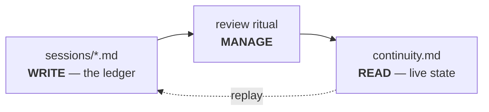

# Evolving Memory

Memory here is **event-sourced**, not a mutable blob. It evolves the way human memory does:
frequently-used facts strengthen, unused ones fade, important ones stay permanent — all in
100% markdown, with the agent doing the work and no code running.

## The ledger and the projection



- **The ledger.** Each work segment writes an **immutable** session log containing a
  `## Memory References` section — the *events* (which facts were referenced, created,
  reactivated, superseded). Session logs are never edited.
- **The projection.** `continuity.md` is the *derived* live state: facts, each carrying a
  metadata footer. The projection is recomputable from the ledger at any time (full replay).

Each fact carries an HTML-comment footer — invisible when rendered, maintained by the agent:

```markdown
- The proxy must stay protocol-agnostic at the transport layer.
  <!-- id: inv-transport-agnostic | created: 2026-06-01 | last_used: 2026-06-27 | uses: 9 | tier: active -->
```

## Deterministic decay

A periodic **review** recomputes usage by *counting session files* — never a floating-point
score — so any agent (Claude, Gemini, …) reaches the **same** result. Facts fade through
tiers:

```
working → active → archive-candidate → archived
```

Nothing is ever deleted; faded facts move to a greppable archive index. See
[Decay & Tiers](decay.md) for the windows and rules.

## Four capabilities that make memory trustworthy

<div class="grid cards" markdown>

-   __Supersession (truth maintenance)__

    When a decision is reversed or a fact becomes false, it is marked `superseded` (terminal)
    with a `superseded-by` link and archived flagged "superseded," not "faded." Memory can
    represent *change*, not just disuse.

-   __Invariant re-verification__

    Never-decay facts (`core` / architectural invariants) are periodically surfaced for a
    human to re-confirm — because "never-decay" must not mean "never-checked" (the
    confidently-wrong failure mode).

-   __Write-time contradiction check__

    When a fact is added, the agent scans for one it contradicts → supersede it, or raise an
    Open Thread. The system **never picks a winner**.

-   __Provenance__

    Each fact can carry an `origin` pointer to its source session — one-hop traceability and
    a cheap defense against memory poisoning.

</div>

## Seeding memory from your docs

Beyond per-session writes, memory seeds itself from the team's existing knowledge. A
**knowledge harvest** recursively reads human-authored docs (ADRs, decision logs, design
specs, roadmaps) and distils the **durable** facts into `memory/` — additively,
*map-don't-mirror*, check-existing-first so a re-run never duplicates, conflicts raised as a
Contradiction thread. It runs once at enable and on demand thereafter (the
[`harvest-knowledge`](../reference/built-in-skills.md#harvest-knowledge) built-in).

## Retrieval is lexical, by design

Retrieval is deliberately **lexical + indexed** (grep + a greppable archive index +
provenance pointers), bounded by project scale — *not* a vector/index server. That keeps the
layer no-code, human-auditable, and replayable.
