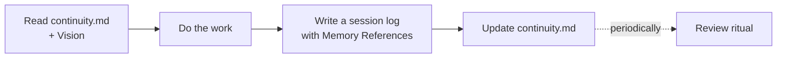

# Getting Started

Three short phases: **install the tool**, **enable a repo**, then **work in that repo**.

agent-memory is no-code — there is nothing to build, no API key, no service to run. You
drive it by talking to your AI agent.

## 1 · Install agent-memory (one-time)

```bash
git clone https://github.com/acn-ericlaw/agent-memory
cd agent-memory
```

Open the cloned folder with your AI agent (Claude Code, Gemini CLI, Cursor, Kiro, GitHub
Copilot, …) and make your **first prompt**:

> **"Start from `AGENTS.md`."**

This points the agent at the hub so it loads the agent-memory protocol *before* doing
anything else. It is the reliable entry point on every vendor — and it is **required** in
enterprise IDEs (e.g. Kiro) that otherwise self-bootstrap from their own onboarding before
reading `AGENTS.md`.

!!! tip "VS Code / Kiro"
    Add the target repo to the **same workspace** as this tool, so the agent can read both.
    Other CLIs (Claude Code, Gemini CLI, …) work fine without this.

## 2 · Enable a target repo

Ask the agent:

> **"AI enable `/path/to/your-project`."**

The agent opens with a short **exec summary** of what the protocol does, what it writes, and
what it leaves untouched — plus a **cancel gate**, so you give informed consent before
anything is written. Then it:

1. **Detects** any existing AI footprint (Cursor, Aider, Copilot, Kiro, …) and offers
   migration (with a dry-run option).
2. **Analyses** the repo (language, stack, type) and **harvests** durable facts from your
   existing docs (ADRs, decision logs, design specs).
3. **Generates** tailored `memory/` files, installs bootstrap pointers for all major agents,
   the six skill adapters, and the git-hook + CI triggers.
4. **Preserves** any originals under `legacy/` — never deleted — and reports exactly what
   happened.

There is **no manual setup step**: the agent activates the local git hook itself, and CI is
the zero-config backstop.

## 3 · Work in your AI-enabled repo

```bash
# Commit the freshly enabled repo
cd /path/to/your-project
git add . && git commit -m "chore: AI-enable repo"
```

From now on, **open the target repo with any AI agent and just work**. It reads `memory/`
automatically, orients without re-explaining, and records decisions as it goes. Commits stay
deliberate and human-initiated, with a self-identifying `Co-Authored-By:` trailer.

!!! tip "Pull requests lead with What & Why"
    Enable installs a `.github/pull_request_template.md` so every PR description opens with two
    short sections — **What** (the change) and **Why** (the intent it serves) — and closes with a
    self-identifying `Co-Authored-By:` footer naming your **stable agent name** (e.g. `Claude Code`,
    `Gemini CLI` — the actual AI collaborator, not a model version), all drawn from the session
    log(s) in the PR. It's advisory, never a gate; the *why* is a first-class artifact throughout the
    protocol, so a PR is no exception.

A typical session:



!!! note "Enterprise IDEs (e.g. Kiro)"
    Per-machine vendor dirs (`.kiro/`, `.claude/`, …) are gitignored, so a fresh clone won't
    have them. After the agent loads the protocol, run **`sync skill adapters`** to
    regenerate your local skill adapters. Anything the IDE later deposits in `.kiro/` stays
    gitignored and per-machine — it never touches the shared `memory/` layer.

## What gets created

| Path | What it is |
|---|---|
| `memory/continuity.md` | The live project state — facts, decisions, open threads |
| `memory/vision.md` | The north star (a DRAFT you confirm; never fabricated) |
| `memory/sessions/` | Immutable, dated session logs — the event ledger |
| `memory/archive/` | Faded facts + a greppable `INDEX.md` (nothing is deleted) |
| `AGENTS.md` | The hub every vendor's agent reads first |
| `agent-skills/` | Portable, vendor-neutral skills (with seven built-ins) |
| `.github/pull_request_template.md` | Seeds the **What / Why** PR-description convention |
| `.agent/version.md` | The install manifest (gates in-place upgrades) |

## Next steps

<div class="grid cards" markdown>

-   [:octicons-arrow-right-24: How memory evolves](concepts/evolving-memory.md)
-   [:octicons-arrow-right-24: Enable a repo (detailed)](guides/enable-a-repo.md)
-   [:octicons-arrow-right-24: The built-in skills](reference/built-in-skills.md)
-   [:octicons-arrow-right-24: Which vendors are supported](reference/vendor-support.md)

</div>
