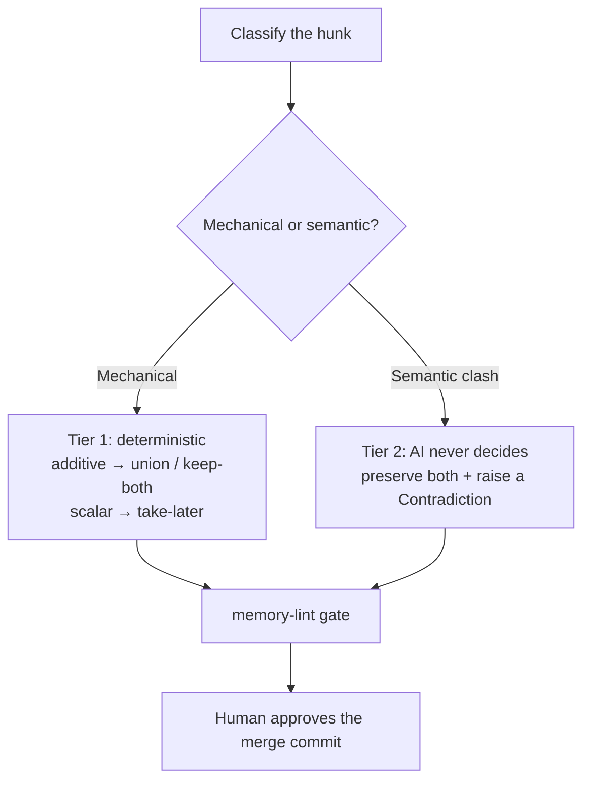

# Resolve Merge Conflicts

When two contributors evolve `memory/` in parallel, a git merge or rebase can conflict.
**`MERGE.md`** is the installed, no-code, on-demand protocol for resolving it — tiered and
human-gated, enforcing `never-pick-a-winner`.

## Ask the agent

> **"Resolve the memory merge conflict."**

## The tiers

- **Tier 1 — mechanical.** Append-only sections (session logs, archive) → union/keep-both.
  Scalar fields (a counter, a date) → take-later. Fully deterministic.
- **Tier 2 — semantic clash.** Two facts genuinely disagree. The AI **never decides** — it
  preserves both and raises a **Contradiction** Open Thread. A supersession happens *only* on
  your explicit instruction.
- **Gate.** [`memory-lint`](../reference/built-in-skills.md#memory-lint) must pass.
- **Approval.** **You** approve the merge commit — never auto-commit.

## Why `status` rarely conflicts now

The `continuity.md` `status` field is specified as a **short current-state line, not a
changelog**. A single accreted `status` line used to be a merge hotspot for concurrent
teammates; keeping it lean (one fact per line; append-only sections union; scalar bumps
take-later) removes most conflicts before they happen.

For the authoritative protocol, see [`MERGE.md`](../reference/protocol-files.md).
