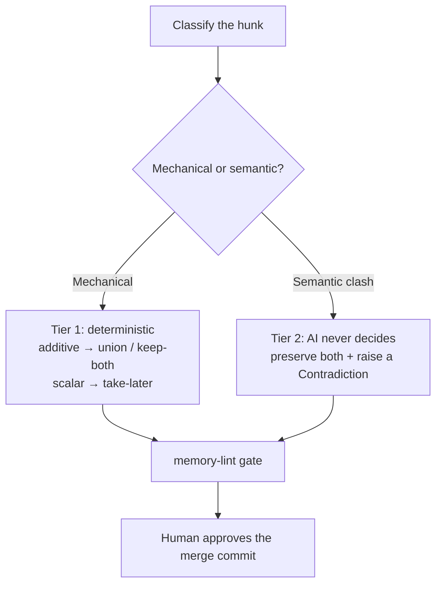

# Resolve Merge Conflicts

When two contributors evolve `memory/` in parallel, a git merge or rebase can conflict.
**`MERGE.md`** is the installed, no-code, on-demand protocol for resolving it — tiered and
human-gated, enforcing `never-pick-a-winner`.

## Ask the agent

> **"Resolve the memory merge conflict."**

## The tiers

```mermaid
flowchart TD
  A[Classify the hunk] --> B{Mechanical or semantic?}
  B -->|Mechanical| C[Tier 1: deterministic<br/>additive → union / keep-both<br/>scalar → take-later]
  B -->|Semantic clash| D[Tier 2: AI never decides<br/>preserve both + raise a Contradiction]
  C --> E[memory-lint gate]
  D --> E
  E --> F[Human approves the merge commit]
```

- **Tier 1 — mechanical.** Append-only sections (session logs, archive) → union/keep-both.
  Scalar fields (a counter, a date) → take-later. Fully deterministic.
- **Tier 2 — semantic clash.** Two facts genuinely disagree. The AI **never decides** — it
  preserves both and raises a **Contradiction** Open Thread. A supersession happens *only* on
  your explicit instruction.
- **Gate.** [`memory-lint`](../reference/built-in-skills.md#memory-lint) must pass.
- **Approval.** **You** approve the merge commit — never auto-commit.

## Why most conflicts no longer happen (v4.39.0)

As team adoption grew, the two measured merge hotspots were removed **structurally** —
no merge-time machinery:

- **One Open Thread per file.** Threads live in `memory/open-threads/thread-<id>.md`
  (filename = the fact id; the directory is the index). Parallel work on *different*
  threads cannot conflict. Same-thread edits conflict only when they touch
  **adjacent/overlapping** lines — that conflict *is* the Tier 2 human gate, preserved by
  design; edits separated by even one unchanged line merge cleanly with **both sides
  kept**, and consistency between the survivors is the write-time contradiction check's
  job.
- **`last_session` is gone.** It bumped on nearly every session and conflicted constantly;
  it was always derivable from the newest session log, so v4.39.0 dropped it.
- **Archive files union-merge.** `memory/archive/*.md merge=union` in `.gitattributes` —
  git-native, backstopped by the `[both]`/`[over-archived]` lint checks.
- **`status` stays a short current-state line, not a changelog** — one fact per line, so
  concurrent bumps rarely collide.

For the authoritative protocol, see [`MERGE.md`](../reference/protocol-files.md); the
design record is `docs/DESIGN-merge-scale.md`.
