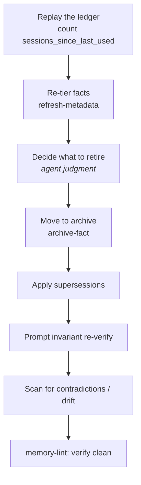

# Review Memory

The review is the **manage** step of the memory loop: it replays the ledger, re-tiers facts,
archives the faded ones, applies supersessions, prompts invariant re-verification, and scans
for contradictions and altitude drift.

## When it runs

- On **cadence** — at least every `review_every` sessions (default 10).
- On **demand** — any time you ask.
- When [`memory-lint`](../reference/built-in-skills.md#memory-lint) raises a `[review-overdue]`
  or `[continuity-bloat]` advisory, so a lapsed review can't silently hide.

## Ask the agent

> **"Run the memory review."**

## What happens

The split is deliberate — **mechanize the arithmetic, leave the judgment to the agent**:

| Step | Who does it |
|---|---|
| Recompute tier / `uses` / `last_used` | [`refresh-metadata`](../reference/built-in-skills.md#refresh-metadata) (deterministic) |
| Decide *which* faded facts to retire | the agent (judgment — never automated) |
| Perform the archive *move* | [`archive-fact`](../reference/built-in-skills.md#archive-fact) (truncation-proof) |
| Verify the result | [`memory-lint`](../reference/built-in-skills.md#memory-lint) (read-only) |

## Safety

- **Never truncate a memory file when scripting a move.** Append with `>>` / append-mode for
  the archive + `INDEX.md`; read-into-a-variable-then-write for `continuity.md`.
- **Run `memory-lint` after any scripted memory mutation.** It catches a truncation (count
  drops, links dangle); git-tracked files recover via `git checkout HEAD -- <file>`.
- Archived ids go in the `## Memory Review` block of the session log, **never** under
  `## Memory References` (that would re-arm the over-archival guard and falsely reactivate
  the fact).

For the authoritative ritual, see [`REVIEW.md`](../reference/protocol-files.md) and
[`DECAY.md`](../reference/protocol-files.md).
