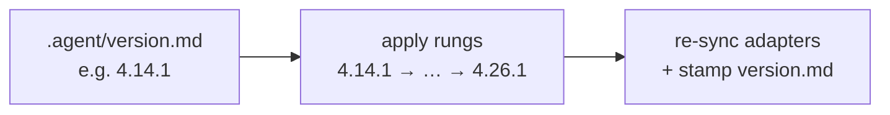

# Upgrade in Place

agent-memory upgrades are **additive and non-destructive**. A repo on an older version moves
forward through an idempotent **version ladder** — one rung per release — so you never lose
local content.

## How versioning works

- The tool's current version lives in `VERSION`; each enabled repo records its own in
  `.agent/version.md` (the install manifest).
- The gap between the two tells the agent which **rungs** to apply, in order.
- **One version per release.** `VERSION` and the ladder track release *events*, not
  per-feature dev iterations.

## Ask the agent

> **"AI enable `/path/to/your-project`."**

When the repo is already enabled but behind, the agent detects the drift from
`.agent/version.md` and walks the ladder. Each rung is **idempotent** — re-running is safe.

## What a rung may do

- Re-sync a protocol file from its canonical source.
- Install a new built-in skill, then re-sync adapters.
- Merge (never overwrite) into a repo-customized file — and **warn before overwriting** a
  locally-modified built-in, letting you keep yours, take the update, or upstream the fix.

!!! info "Source of truth matters"
    A target's `AGENTS.md` is re-synced from **`templates/AGENTS.md`** (the memory hub), never
    from the tool's *root* `AGENTS.md` (the operator dispatcher). The ladder encodes this
    per-file map so an upgrade can't mis-source a file.

## After a new built-in is installed

Some runtimes load skill adapters only at startup. If your runtime does (e.g. **GitHub
Copilot CLI** parses `.github/skills/` at init), a freshly-installed skill won't be live until
you reload — `/restart` or a skills rescan. Claude, Cursor, and Kiro pick up a new
description-matched skill without a restart.

## Verify

After an upgrade, run [`memory-lint`](../reference/built-in-skills.md#memory-lint). A clean
run (0 errors) confirms the install manifest, decay counts, and links are all consistent.

For the authoritative ladder and rungs, see [`UPGRADE.md`](../reference/protocol-files.md)
(operator-only).
