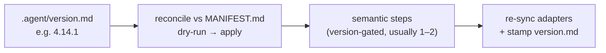

# Upgrade in Place

agent-memory upgrades are **additive and non-destructive** — and since **v4.35.0** they run
in **O(diff), not O(rungs)**: the agent reconciles your repo against the current version's
declared target state in one pass, instead of walking every release you're behind.

## How versioning works

- The tool's current version lives in `VERSION`; each enabled repo records its own in
  `.agent/version.md` (the version stamp).
- **`MANIFEST.md`** (tool-side) declares the target state — every installed artifact with
  its source and policy — plus the **Semantic steps** table: the few version-gated
  migrations a file-sync can't do (metadata backfill, knob merges that preserve your
  tuning, secret triage).
- **One version per release.** `VERSION` and the ladder track release *events*, not
  per-feature dev iterations. The ladder (`UPGRADE.md`) remains the per-version record
  and the detailed text behind each semantic step.

## Ask the agent

> **"AI enable `/path/to/your-project`."**

When the repo is already enabled but behind, the agent detects the drift from
`.agent/version.md` and runs the **reconcile helper**: a dry-run report first (what will
be copied, what drifted, what stays yours), then — with your consent — one apply pass,
the applicable semantic steps, and the version stamp. A semantic step labelled
`PRE-APPLY` runs before the apply pass and is followed by a confirming dry-run; the CLI
refuses writes until protected protocol files converge, then requires
`--pre-apply-complete` to attest that the listed preservation and hash checks are done.
This protects content that a mechanical re-copy would otherwise replace. Re-running is
safe (idempotent).

```mermaid
flowchart LR
  V[".agent/version.md<br/>e.g. 4.14.1"] --> R["reconcile vs MANIFEST.md<br/>dry-run → apply"]
  R --> SS["semantic steps<br/>(version-gated, usually 1–2)"]
  SS --> S[re-sync adapters<br/>+ stamp version.md]
```

## What reconcile may do — and never does

- Re-copy a stale tool-owned file from its canonical source; seed a missing one.
- Add missing entries to the managed `.gitignore`/`.gitattributes` blocks (add-only,
  de-duplicated — it also catches entries older upgrades never back-filled).
- **Never**: overwrite your seeded files (`continuity.md`, your PR template, your waiver
  stub), edit a pre-existing `.gitlab-ci.yml`, delete anything, or stamp the version
  itself. Drift that looks like a local customization gets a **warn before overwrite** —
  keep yours, take the update, or upstream the fix.

!!! info "Source of truth matters"
    A target's one-line `AGENTS.md` comes from **`templates/AGENTS.md`** and its canonical
    protocol comes from **`templates/memory/PROTOCOL.md`**, never the tool's dual-mode
    `memory/PROTOCOL.md`. The manifest encodes this per-file map so an upgrade cannot
    install operator routing into a target.

## After a new built-in is installed

Some runtimes load skill adapters only at startup. If your runtime does (e.g. **GitHub
Copilot CLI** parses `.github/skills/` at init), a freshly-installed skill won't be live until
you reload — `/restart` or a skills rescan. Claude, Cursor, and Kiro pick up a new
description-matched skill without a restart.

## Verify

After an upgrade, run [`memory-lint`](../reference/built-in-skills.md#memory-lint). A clean
run (0 errors) confirms the version stamp, decay counts, and links are all consistent.

For the authoritative target state and semantic steps, see `MANIFEST.md`; for the
per-version record and rung detail, see [`UPGRADE.md`](../reference/protocol-files.md)
(both operator-only).
